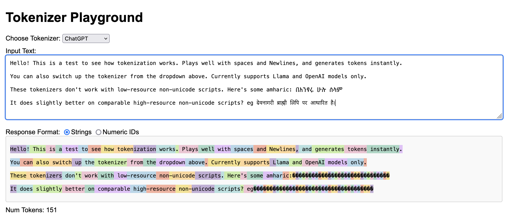

# Tokenizer Playground

This was something hacked together over an evening to see how tokenizers
behave with english and non-english scripts, and if there are significant 
variations in the tokenization for small prompt perturbations.

## Quick Start

```
git clone https://github.com/Aniruddha-Deb/tokenizer-playground && cd tokenizer-playground
pip install -r requirements.txt
flask run
```

Then go to [http://127.0.0.1:5000/static/index.html](http://127.0.0.1:5000/static/index.html)



## TODO

- [X] OpenAI tokenizer support
- [X] LLaMa 2 tokenizers
- [ ] PaLM tokenizers
- [X] HF tokenizers integration
